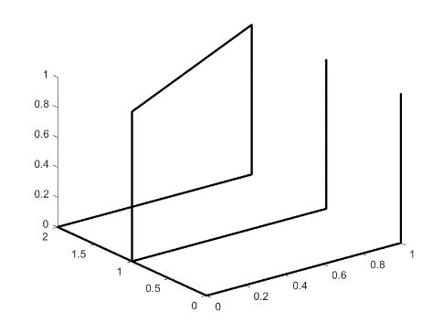
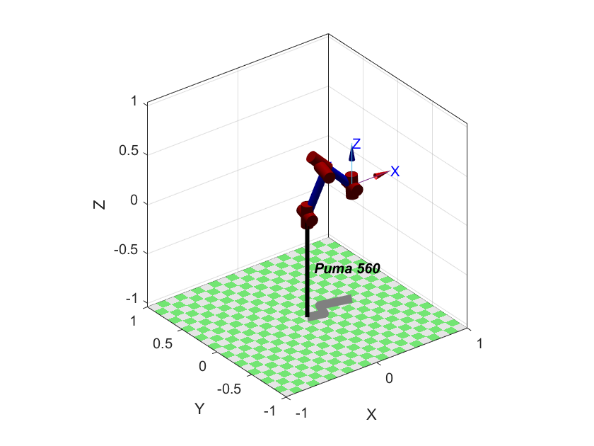
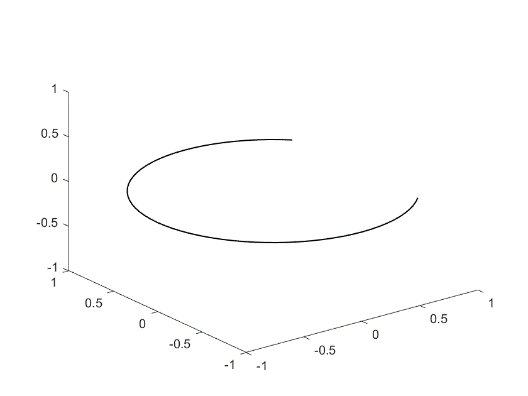
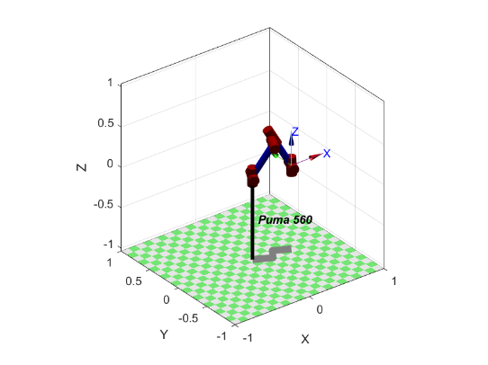
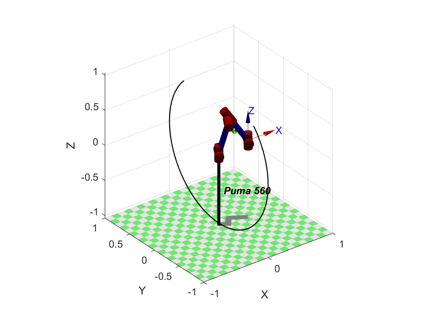

# PUMA 560 Robot Kinematics & Trajectory Planning

[](#)
[](#)
[](LICENSE)


A MATLAB robotics portfolio project covering **3-D rotation representations, Euler-angle conversion, Cartesian path generation, trajectory interpolation, inverse kinematics, and PUMA 560 simulation** with Peter Corke's Robotics Toolbox.

> This repository is a public-facing refactor of university robotics coursework completed in 2023–2024. The original algorithms and experiments were reorganized, corrected, documented, and separated from private academic records for portfolio use.

[简体中文 README](README.zh-CN.md)

## Highlights

- Implements **Z-Y-X** and **Z-Y-Z** Euler-angle / rotation-matrix conversions with explicit conventions.
- Validates proper rotation matrices and handles Euler-angle singularities deterministically.
- Generates Cartesian drawing paths for the letters **E** and **C**, including a vertical-plane path.
- Uses `mstraj` for multi-segment Cartesian interpolation.
- Maps Cartesian paths into the PUMA 560 workspace and solves inverse kinematics with `ikine6s`.
- Includes lightweight toolbox-independent tests for the rotation utilities.
- Documents the earlier transformation, DH-model, kinematics, and trajectory-planning experiments without publishing course handouts or copyrighted teaching material.

## Project pipeline

```text
Euler angles / waypoints
          │
          ├──> rotation matrix validation & conversion
          │
          └──> Cartesian path generation
                     │
                     v
                 mstraj
                     │
                     v
          homogeneous poses (SE(3))
                     │
                     v
             PUMA 560 ikine6s
                     │
                     v
              joint trajectory
                     │
                     v
               3-D simulation
```

## Original coursework results

The following screenshots are preserved from the original report as historical evidence of the simulation work. The public code in this repository has since been cleaned up and corrected.

| Letter E path | PUMA 560 simulation |
| --- | --- |
|  |  |

| Letter C path | PUMA 560 simulation |
| --- | --- |
|  |  |

### Vertical-plane trajectory



## Repository structure

```text
.
├── examples/                 # Runnable MATLAB demos
├── src/
│   ├── robot/                # PUMA 560 simulation / dependency checks
│   ├── trajectory/           # Path generation and mstraj interpolation
│   └── transforms/           # Rotation / Euler-angle utilities
├── tests/                    # Toolbox-independent MATLAB assertions
├── docs/
│   ├── experiments/          # Clean summaries of the coursework experiments
│   └── images/               # Selected original simulation screenshots
├── private-original-reports/ # Local-only archive; ignored by Git
├── REQUIREMENTS.md
└── setup_project.m
```

## Quick start

### 1. Install the dependencies

See [REQUIREMENTS.md](REQUIREMENTS.md). The PUMA and `mstraj` demos require **Peter Corke's Robotics Toolbox for MATLAB**.

### 2. Add project functions to the MATLAB path

From the repository root:

```matlab
setup_project
```

### 3. Run the toolbox-independent tests

```matlab
run('tests/run_tests.m')
```

These tests cover rotation-matrix validity and Z-Y-X / Z-Y-Z conversion round trips, so they can run without the robotics toolbox.

### 4. Run demos

```matlab
run('examples/demo_rotation_conversion.m')
run('examples/demo_letter_e.m')
run('examples/demo_letter_c.m')
run('examples/demo_vertical_letter_c.m')
run('examples/demo_speed_comparison.m')
```

## Rotation convention

Ambiguous Euler-angle naming was one of the main issues in the original coursework code. This refactor uses explicit axis names throughout.

For Z-Y-X:

```text
R = Rz(z) * Ry(y) * Rx(x)
```

and the returned angle vector is always:

```text
[z, y, x]
```

For Z-Y-Z:

```text
R = Rz(phi) * Ry(theta) * Rz(psi)
```

Because Euler decompositions are non-unique, singular configurations are flagged and represented using a deterministic convention. See `src/transforms/rotationMatrixToEuler.m`.

## What was improved from the coursework version?

The original submission demonstrated the intended robotics concepts, but it was structured as assignment code rather than a reusable project. This public refactor makes several engineering corrections:

- separated function definitions from interactive scripts;
- replaced ambiguous `alpha/beta/gamma` naming with explicit axis-based parameters;
- corrected the Z-Y-X ordering in the conversion API;
- replaced the earlier Z-Y-Z inverse equations with a consistent decomposition;
- added rotation-matrix validation and singularity handling;
- removed the mixed `rigidBodyTree` / Peter Corke API fragment and standardized the simulation path on Peter Corke's toolbox;
- reorganized repeated trajectory code into reusable functions;
- replaced the ad-hoc E waypoint sequence with a documented planar stroke path;
- kept personal academic reports outside Git via `.gitignore`;
- excluded textbooks, lecture slides, answer sheets, and other non-author material from the repository.

A more detailed provenance note is available in [docs/PROJECT_ORIGIN.md](docs/PROJECT_ORIGIN.md).

## Coursework topics represented

The repository consolidates concepts from three laboratory exercises and the final course design:

- **Rigid transformations:** rotation matrices, homogeneous transformations, RPY / Euler representations.
- **Robot modelling:** standard and modified DH parameters and serial-link robot models.
- **Kinematics:** Cartesian poses and analytical inverse kinematics for PUMA 560.
- **Trajectory planning:** polynomial interpolation, joint-space planning, Cartesian-space planning, and multi-segment trajectories.
- **Robot drawing:** end-effector paths for E/C shapes with speed, scale, and drawing-plane variations.

See [`docs/experiments/`](docs/experiments/) for the clean experiment summaries.

## Limitations

- This is a **simulation project**, not a hardware-control stack.
- The PUMA demos depend on external toolbox behavior and were not executed in the packaging environment because MATLAB and Peter Corke's toolbox were unavailable there.
- IK feasibility depends on the chosen workspace offset, tool orientation, toolbox version, and robot configuration.
- The project intentionally focuses on classical kinematics and trajectory planning; it does not implement dynamics, feedback control, collision avoidance, SLAM, or perception.

## Skills demonstrated

`MATLAB` · `robotics` · `linear algebra` · `SO(3)` · `SE(3)` · `Euler angles` · `inverse kinematics` · `trajectory planning` · `PUMA 560` · `simulation`

## License

The refactored source code is released under the [MIT License](LICENSE). Selected screenshots originate from the author's own coursework report. Third-party textbooks, slides, reference answers, and teaching materials are intentionally not redistributed.
